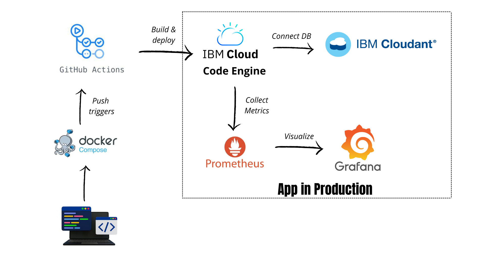

# 🚀 Task Tracker - DevOps Learning Project

  

*Modern task management app demonstrating IBM Cloud DevOps workflows*

## ✨ Why This Project?
- **Learn by doing**: Full CI/CD pipeline from code to cloud
- **Real-world tools**: GitHub Actions, IBM Cloud, Prometheus/Grafana
- **Production-grade**: Containerized, monitored, and scalable
- **Perfect for beginners**: Focused scope with enterprise patterns

## 🛠 Tech Stack
| Component          | Technology             | Purpose                          |
|--------------------|------------------------|----------------------------------|
| **Backend**        | Express.js             | REST API for tasks               |
| **Database**       | IBM Cloudant (NoSQL)   | Task storage                     |
| **CI/CD**          | GitHub Actions         | Automated build/test/deploy      |
| **Deployment**     | IBM Cloud Code Engine  | Serverless container runtime     |
| **Monitoring**     | Prometheus + Grafana   | Metrics collection & visualization |
| **Local Dev**      | Docker Compose         | Replicate prod environment       |

## 🚦 Workflow 
    A[Local Dev] -->|Push to GitHub| B[GitHub Actions]
    B -->|Build & Deploy| C[IBM Code Engine]
    C -->|Connect DB| D[Cloudant]
    C -->|Expose Metrics| E[Prometheus]
    E -->|Visualize| F[Grafana]

---

## Architecture (quick)
1. Express app (single container)  
2. Container built by Code Engine from GitHub → stored in IBM container registry (managed)  
3. Container runs on Code Engine; connects to Cloudant for data storage  
4. Logs forwarded to LogDNA for searching and debugging

---

## Endpoints (examples)
- `GET /health` — service + DB health  
- `GET /tasks` — list tasks  
- `POST /tasks` — create a task `{ title, description, done }`  
- `GET /tasks/:id` — get task  
- `PUT /tasks/:id` — update task  
- `DELETE /tasks/:id` — delete task

*(Use Postman or curl for testing)*